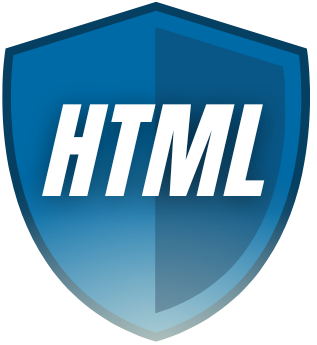
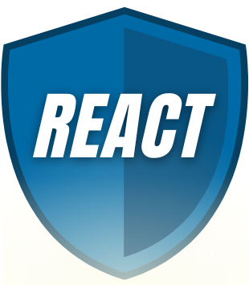

#  Task List Website 

 Made by Klaudia Kępka

##  Task List Demo Website:
[Task List Demo Website](https://kepkaklaudia.github.io/task-list-redux/)

##  Quick Preview

## Add new task field
On the page you can find the input field to add your task

## Add new task button
On the right side of the input field you can find a button in teal color which is used to add tasks to the list.

After clicking it, the cursor will automatically focus on the input field to enter a new task.

## Download example tasks button
Above Add new task button you can find a special button which you can use to download example tasks. When you press it you will see "Loading" text. Current list will be deleted and then new tasks appear.

When something goes wrong, you will see the right information in the List of Tasks.

## Filter tasks
You can use search field to filter all tasks. Searching process starts with one letter.

## List of Tasks
After added new task it will be written below in the List of Tasks.

On the left side of the task you will see a green square - it is a marker that allows you to mark whether the task has been completed ✅. When you click it, a check mark will appear in the square and the text will be crossed out. When you click it again, both the strikethrough and the check mark will disappear.

On the right of the task, you'll see a red square with a trash can icon 🗑. After clicking it, the corresponding task will be deleted.

After adding a task, two buttons "Ukryj ukończone" and "Ukończ wszystkie" will appear on the right side of the section. 

When you have any completed tasks in your list, you can hide them with the first button. The button will change its name to "Pokaż ukończone" - when you click it again, all your completed tasks will be shown again. 

You can use the second button to complete all your quests. When all tasks are completed, this button is inactive.

## Details of each task
When you click on a specific task, a new subpage will be opened. You will see the details of the clicked task, especially whether the task has been completed or not.

## About author
After clicking "About the author" tab, you will go to a subpage containing a few words about the author of the application.

## Responsive version
When you are in mobile/tablet mode (maximum width of screen: 550px) you can notice some changes.

The input field outline illumination changes from black to orange. In addition, both the input field and the button take up the entire available width.

# Getting Started with Create React App

This project was bootstrapped with [Create React App](https://github.com/facebook/create-react-app).

## Available Scripts

In the project directory, you can run:

### `npm start`

Runs the app in the development mode.\
Open [http://localhost:3000](http://localhost:3000) to view it in your browser.

The page will reload when you make changes.\
You may also see any lint errors in the console.

### `npm test`

Launches the test runner in the interactive watch mode.\
See the section about [running tests](https://facebook.github.io/create-react-app/docs/running-tests) for more information.

### `npm run build`

Builds the app for production to the `build` folder.\
It correctly bundles React in production mode and optimizes the build for the best performance.

The build is minified and the filenames include the hashes.\
Your app is ready to be deployed!

See the section about [deployment](https://facebook.github.io/create-react-app/docs/deployment) for more information.

## Technologies used
     
  

      
